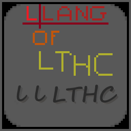

<div align="center">

<div/>
<hr/>
<div align="left">
<div/>
<hr/>

# L Lang of LTHC or also LTHC PIYN Lang

## What is L Lang of LTHC
**L Lang of LTHC** is a programming language interpreted with Python. This langage is written in .llangl file
## Can I copy and create my own version of this project
I allow you to copy and create your own version of this project
## Can I contribute to the original project
Yes you can
## An example hello word program:
```
VARS a =Hello World !;
VARS a >;
```
result:
```
Hello World!
```
## Warning: This language is very very case sensitive
## Info: Program lines in file must be ended by a '^' or a ';'